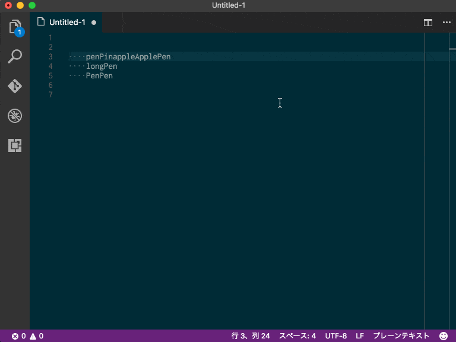
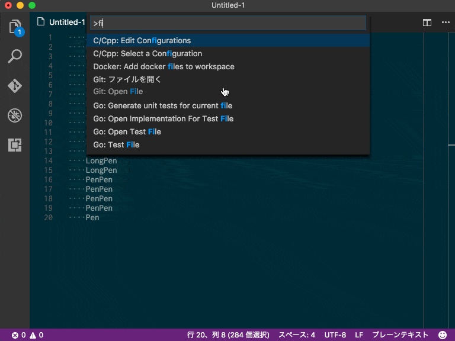
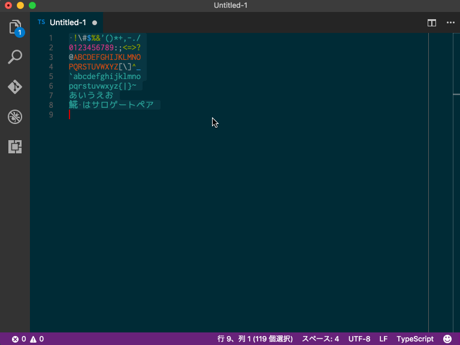
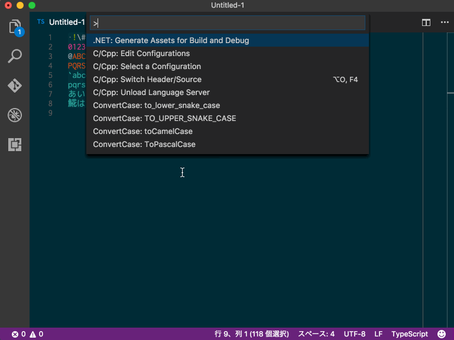
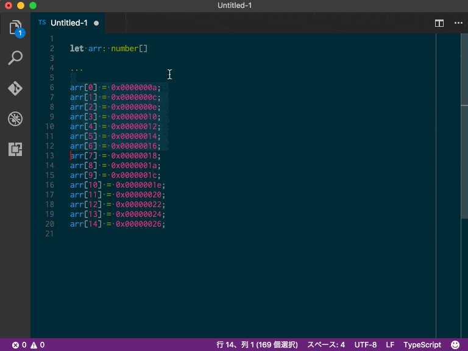
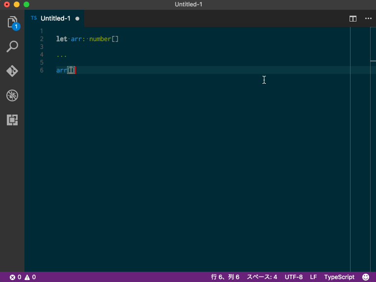

# Harurow Util README

[](https://travis-ci.org/Harurow/vscode.ext.harurow.util)

## 特徴
自分でプログラムを書くときに利用する機能をVisualStudioCodeの拡張として提供しています
[Github](https://github.com/Harurow/vscode.ext.harurow.util)でソースも公開しています

#### 変数のケース変換
選択中の文字列をのケースを変換します



- `ToPascalCase`  
パスカルケース(PascalCase)へ変換します

- `toCamelCase`  
キャメルケースへ(camelCase)変換します

- `TO_UPPER_SNAKE_CASE`  
大文字のスネークケース(SNAKE_CASE)へ変換します

- `to_lower_snake_case`  
小文字のスネークケース(snake_case)へ変換します

#### 行フィルタ
選択中の行をフィルタンリングします
正規表現または単純な検索が条件として利用できます  



- `Remove Line If Contains String`  
入力文字が含まれる行を削除します

- `Remove Line If NOT Contains String`  
入力文字が含まれる行は残し、そうではない行を削除します

- `Remove Line If Matched Regex`  
正規表現に一致した行を削除します

- `Remove Line If Un-Matched Regex`  
正規表現に一致する行は残し、そうでない行を削除します

#### パーセントエンコード変換
選択中の文字列を % エンコーディングします  



- RFC3986 は スペースを`%20`に
- RFC1866 は スペースを`+`に  
へ変換します。  

日本語のエンコーディングについては ShiftJIS, EUC-JP, UTF-8のいずれかを選べます  

##### エンコード
- `To Percent Encoding (RFC3986 ' ' => %20) / Shift_JIS`
- `To Percent Encoding (RFC3986 ' ' => %20) / EUC-JP`
- `To Percent Encoding (RFC3986 ' ' => %20) / UTF-8`  
- `To Percent Encoding (RFC1866 ' ' => +) / Shift_JIS`
- `To Percent Encoding (RFC1866 ' ' => +) / EUC-JP`
- `To Percent Encoding (RFC1866 ' ' => +) / UTF-8`  

##### デコード
- `From Percent Encoding (RFC3986, RFC1866) / Shift_JIS`
- `From Percent Encoding (RFC3986, RFC1866) / EUC-JP`
- `From Percent Encoding (RFC3986, RFC1866) / UTF-8`

#### エスケープ処理
HTMLまたはUnicodeエスケープ処理を実施します



##### HTMLエンコード・デコード
- `To HTML Escape`
- `To HTML Escape All Charactors`
- `From HTML Escape`

##### Unicodeエンコード・デコード
- `To Unicode Escape`
- `To Unicode Escape All Charactors`
- `From Unicode Eescape`

#### 文字の選択
正規表現または指定した文字に一致する範囲を選択します



- `Select String`  
一致する文字列を選択します

- `Select If Matched Regex`  
正規表現に一致する文字列を選択します

- `Select If Matched Regex (Ignore Case)`  
正規表現(大文字・小文字の違いを無視)に一致する文字列を選択します

#### 連番
複数カーソルの位置に連番で番号を採番します



- `Insert Numbers to Multiple Cursors`  
範囲を複数選択しカーソルを複数設定してからこのコマンドを実行してください
入力エリアにはスペース区切りで数字を指定します  
start 以外は省略可能です  
start step?=1 radix?:[2|10|8|16]=10 len?=0

- start 最初の番号  
  省略不可
- step 増加する値  
  10進数で入力 マイナス可  
  省略した場合は1
- redix 番号のn進数を指定する  
  2, 10, 8, 16のいずれか  
  省略した場合は10
- len 長さ  
  全体の長さを指定し前ゼロを付加する  
  0を指定した場合は前ゼロを付加しない  
  省略した場合は0

#### 変数入れ替え
左右の変数を入れ替え

- `Leftside Right`
左右の変数を入れ替えます
`Left = Right;` を 'Right = Left;'

#### 日付変換
日付の文字列を相互変換します

- `To ISO8601 DateTime Format(yyyy-mm-ddThh:mm:ss.sss)`
- `To C# DateTime Format(\\/Date(nnnnnnnnnn)\\/)`

```2017-04-27T15:00:00.000Z```  <=> ```\/Date(1493305200000)\/```  
```2017-04-28T00:00:00.000+0900``` <=> ```\/Date(1493305200000+0900)\/```  
```2017-04-28T00:00:00.000-0900``` <=> ```\/Date(1493305200000-0900)\/```  

#### スクリプト実行
現在開いているファイルの種類（言語）にあったコンパイル・実行を行います。


## Requirements
なし

## Extension Settings
なし

## Known Issues
なし

## Release Notes

### [1.3.3] 2017-xx-xx
現在開いているファイルをスクリプトとしてターミナルで実行する機能を追加

### [1.3.2] 2017-07-19
メンテナンス・リリース。機能の追加・修正はありません。
- ライブラリのバージョンを更新
- CIツールでのビルドエラー（テストの失敗）対応でテストのタイムアウト値を伸ばした

### [1.3.1] 2017-06-26
メンテナンス・リリース。機能の追加・修正はありません。
- ライブラリのバージョンを更新

### [1.3.0] 2017-04-28
日付の変換機能を追加

### [1.2.3] 2017-04-19
変数の左右入れ替えの機能を拡張

### [1.2.2] 2017-04-17
テストケースの追加と修正

### [1.2.1] 2017-04-14
テストケースの最適化

### [1.2.0] 2017-04-11
正規表現のマッチングで大文字・小文字を無視を追加

### [1.1.2] 2017-02-28
プレビューの画像を圧縮

### [1.1.1] 2017-01-26
微修正

### [1.1.0] 2017-01-25
機能追加

### [1.0.3] 2017-01-21
初回リリース

--------------------------------------------------------------------------------
